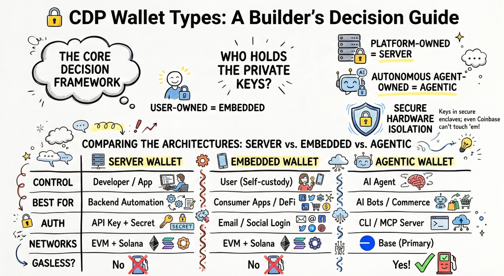
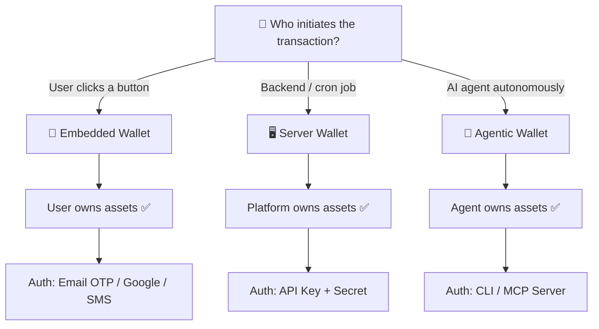
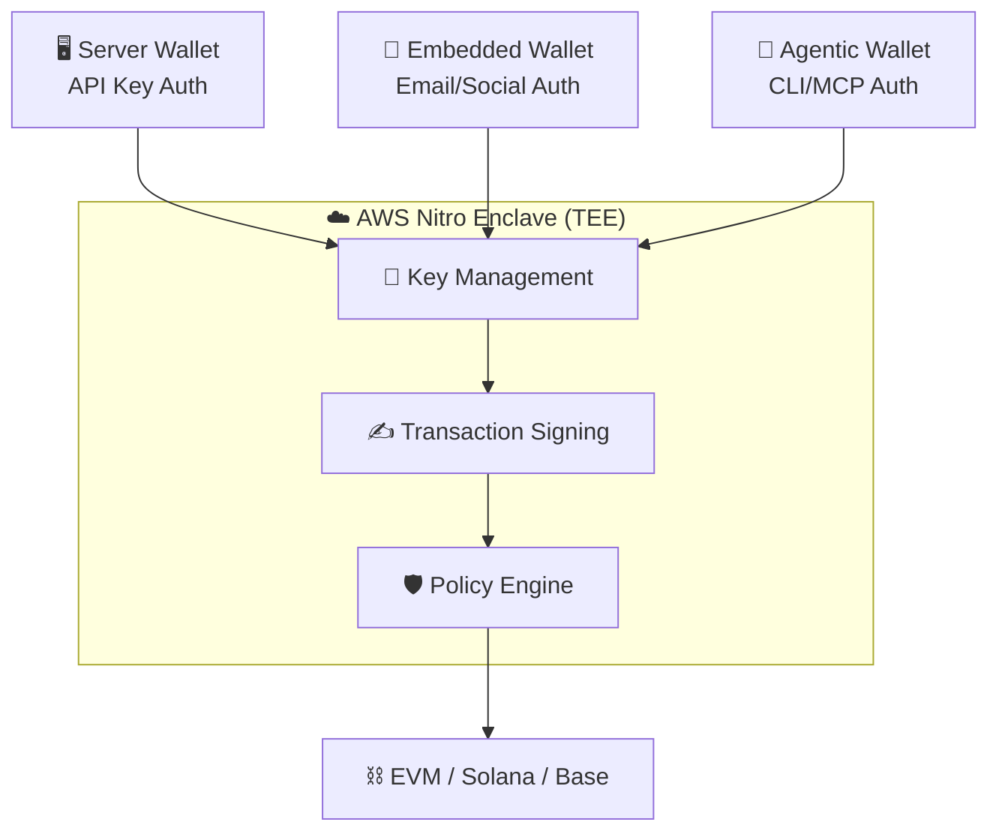

# Ship Faster: Pick the Right CDP Wallet

> A builder's decision guide to CDP Server, Embedded, and Agentic wallets — who holds the keys, when to use each, and how to integrate in minutes.

---

> Every wallet architecture starts with one question: **"Who should hold the private keys?"** Get this wrong and you're rewriting infrastructure 3 months in. CDP gives you 3 answers — pick the right one from day one.

---

## 🔐 What Are CDP Wallets?

Coinbase Developer Platform (CDP) offers three wallet architectures, each designed for a different trust model. All three share the same security foundation — **AWS Nitro Enclave (TEE)** — meaning private keys never leave secure hardware. Not even Coinbase can access them.

The difference? **Who controls the keys and who initiates transactions.**



```
User owns funds   →  Embedded Wallet
App owns funds    →  Server Wallet
Agent owns funds  →  Agentic Wallet
```

---

## ⚡ Quick Comparison

|  | 🖥️ Server Wallet | 👤 Embedded Wallet | 🤖 Agentic Wallet |
| :-- | :-- | :-- | :-- |
| **Controls keys?** | Developer / App | User (self-custody) | AI Agent |
| **Auth method** | API Key + Secret | Email / Social login | CLI / MCP server |
| **Best for** | Backend automation | Consumer apps, DeFi | AI agents, bots |
| **Networks** | All EVM + Solana | All EVM + Solana | Base (primary) |
| **Gasless?** | ❌ | ❌ | ✅ |
| **Key export?** | ❌ | ✅ | ❌ |

---

## 🧭 Decision Flowchart

Use this to pick your wallet type in 30 seconds:



---

## 🏗️ Shared Security Architecture

All three wallet types run on the same hardened infrastructure:



> **Key insight:** You're not choosing between security levels — all three are equally hardened. You're choosing the **trust model** that fits your product.

---

## 🖥️ Server Wallet — Backend Automation

Your backend signs transactions programmatically. No user interaction needed.

**Built for:** Payment gateways · Treasury management · Trading bots · Fee collection

**Key powers:**
- `EIP-4337` Account Abstraction — batch transactions, gas sponsorship, spend limits
- Policy Engine — allowlists, KYT blocking, OFAC auto-screening
- `viem` native — no SDK rewrite needed
- Trade API — swap tokens programmatically in one call
- **< 200ms** signing latency

### Integration Example

```typescript
import { createCdpClient } from "@coinbase/cdp-sdk";

const cdp = createCdpClient({
  apiKeyId: process.env.CDP_API_KEY,
  apiKeySecret: process.env.CDP_API_SECRET,
});

// Create a server wallet
const wallet = await cdp.wallets.create({ network: "base-mainnet" });

// Send USDC programmatically
const tx = await wallet.transfer({
  to: "0xRecipient...",
  amount: "10.00",
  asset: "USDC",
});

console.log(`TX hash: ${tx.transactionHash}`);
```

### When to Use

```
✅ Automated payroll / treasury ops
✅ Trading bots that execute on schedule
✅ Fee collection from smart contracts
✅ Backend-to-backend settlement
❌ User-facing consumer apps (use Embedded instead)
```

📚 [Server Wallet v2 Docs](https://docs.cdp.coinbase.com/server-wallets/v2/introduction/welcome) · [Policy Engine](https://docs.cdp.coinbase.com/server-wallets/v2/policies/overview)

---

## 👤 Embedded Wallet — Consumer UX

User-owned wallet with zero friction. Email login = instant wallet. No seed phrases ever.

**Built for:** Consumer payments · Web3 gaming · Social platforms · NFT marketplaces

**Key powers:**
- Auth: Email OTP, SMS, Google, custom providers (Auth0, Firebase, Cognito)
- Built-in: Onramp/Offramp, Swaps, Staking, **3.85% USDC yield**
- OFAC screening auto-applied on every transfer
- `x402` native — pay for HTTP services directly from the wallet
- Up to 5 devices, key export anytime

### Integration Example

```typescript
import { CoinbaseWalletSDK } from "@coinbase/wallet-sdk";

const sdk = new CoinbaseWalletSDK({
  appName: "MyDApp",
  appLogoUrl: "https://example.com/logo.png",
});

// User signs in with email — wallet created automatically
const provider = sdk.makeWeb3Provider({
  options: "smartWalletOnly",
});

// Request connection (triggers email OTP flow)
const accounts = await provider.request({
  method: "eth_requestAccounts",
});

console.log(`User wallet: ${accounts[0]}`);
```

### When to Use

```
✅ Consumer-facing dApps with email/social login
✅ Games where users own in-game assets
✅ Marketplaces where users buy/sell NFTs
✅ Any app where users must control their own funds
❌ Backend automation (use Server instead)
❌ AI agent workflows (use Agentic instead)
```

📚 [Embedded Wallet Docs](https://docs.cdp.coinbase.com/embedded-wallets/welcome) · [x402 Integration](https://docs.cdp.coinbase.com/embedded-wallets/x402-payments)

---

## 🤖 Agentic Wallet — AI Agent Commerce

Wallet built for autonomous agents. Self-directed spending with built-in guardrails.

**Built for:** Trading agents · Research agents · DeFi yield bots · Agent-to-agent commerce

**Key powers:**
- `x402` auto-payment — agent detects HTTP 402 → auto-pays with USDC → retries
- Gasless trading on Base — agents never fail from empty gas
- CLI mode (developers) or MCP server (Claude, Gemini, Codex — no code)
- Spend limits + audit trail at infrastructure level

### Integration Example

```typescript
import { AgentWallet } from "@coinbase/cdp-agent";

const agent = new AgentWallet({
  network: "base",
  spendLimit: "50.00", // USDC daily cap
});

// Agent autonomously pays for an x402 service
const response = await agent.fetch("https://api.dataprovider.com/report", {
  method: "GET",
  autoPayX402: true, // auto-detect 402 → pay → retry
});

// Agent got the data, paid $0.01 USDC, zero gas fees
console.log(response.data);
```

### When to Use

```
✅ AI agents that consume paid APIs autonomously
✅ Trading bots on Base with gasless execution
✅ Agent-to-agent commerce via x402
✅ Research agents that pay for data on demand
❌ User-facing apps (use Embedded instead)
❌ Multi-chain backend ops (use Server instead)
```

📚 [Agentic Wallet Docs](https://docs.cdp.coinbase.com/agentic-wallet/welcome) · [x402 Whitepaper](https://www.x402.org/x402-whitepaper.pdf)

---

## 🏁 Quick Decision Framework

Still not sure? Run through these 4 questions:

```
Who initiates tx?   →  user = Embedded  ·  backend = Server  ·  agent = Agentic
Who owns assets?    →  user = Embedded  ·  platform = Server  ·  agent = Agentic
What network?       →  multi-chain = Server/Embedded  ·  Base-only = Agentic
Compliance need?    →  consumer KYC = Embedded  ·  enterprise audit = Server
```

### Resource Links

| Resource | Link |
|---|---|
| CDP Wallet Comparison | [docs.cdp.coinbase.com/server-wallets/comparing-our-wallets](https://docs.cdp.coinbase.com/server-wallets/comparing-our-wallets) |
| Server Wallet v2 Docs | [docs.cdp.coinbase.com/server-wallets/v2](https://docs.cdp.coinbase.com/server-wallets/v2/introduction/welcome) |
| Embedded Wallet Docs | [docs.cdp.coinbase.com/embedded-wallets](https://docs.cdp.coinbase.com/embedded-wallets/welcome) |
| Agentic Wallet Docs | [docs.cdp.coinbase.com/agentic-wallet](https://docs.cdp.coinbase.com/agentic-wallet/welcome) |
| x402 Protocol | [x402.org](https://www.x402.org) |

---

### 🔗 Join the Movement

- **🐦 Follow us:** [https://x.com/overguildOG](https://x.com/overguildOG)
- **🛠️ Try new tools:** [https://leo-book.xyz/](https://leo-book.xyz/)

---

*Built with 💙 on Base by [OverGuild](https://x.com/overguildOG)*
