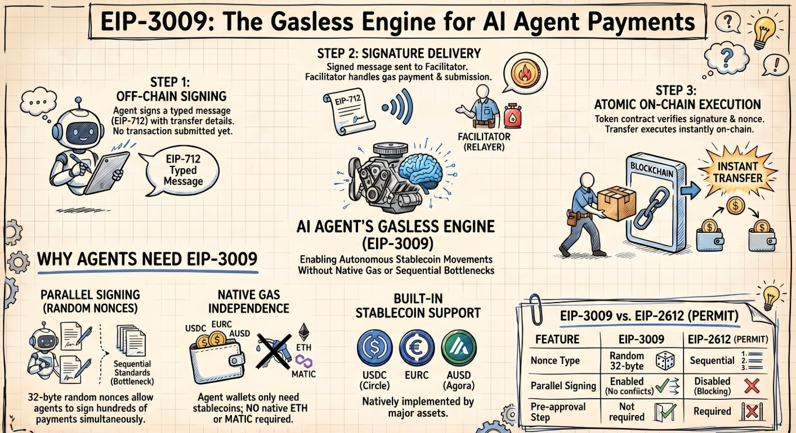

# ⚡ Gasless Signing Powers Agentic Payments

> EIP-3009 lets AI agents authorize stablecoin transfers with just a signature — no gas, no ETH, no sequential nonces. The foundational standard behind x402 and the machine economy.



---

## 🔍 What Is EIP-3009?

**EIP-3009** is an Ethereum token standard that lets a token holder authorize a transfer using just a **cryptographic signature — no on-chain transaction, no gas required from the sender**.

It introduces two functions to any ERC-20-compatible token contract:

- `transferWithAuthorization` — authorize anyone to move your tokens
- `receiveWithAuthorization` — authorize a specific recipient to pull tokens

The standard was proposed in 2020 and is natively implemented by:

- ⭕ **USDC** (Circle)
- 🔵 **EURC** (Circle)
- 🟡 **AUSD** (Agora)

These are the primary stablecoins used in agentic payment systems today.

> 🏷️ **Related:** `#ERC-20` `#EIP-712` `#EIP-2612` `#Permit2` `#x402` `#USDC`

---

## 🧠 The Problem It Solves

In standard ERC-20 transfers, **the sender must initiate and pay for the on-chain transaction** using native gas (ETH). This creates two critical problems for autonomous systems:

- 🔴 **Gas dependency** — the agent wallet must always hold native ETH just to move stablecoins
- 🔴 **Sequential nonces** — transactions must be ordered and executed one-by-one, blocking parallel operations

EIP-3009 eliminates both by moving the **authorization step off-chain** and delegating gas payment to a third-party relayer (the *facilitator*).

---

## ⚙️ How EIP-3009 Works (Step-by-Step)

### Step 1 — 🖊️ Off-Chain Signing (The Agent)

The token holder (or AI agent wallet) creates an **EIP-712 typed structured message** containing:

- `from` — payer's wallet address
- `to` — recipient's wallet address
- `value` — token amount (e.g., 10000 = $0.01 USDC)
- `validAfter` — unix timestamp, earliest valid time
- `validBefore` — unix timestamp, expiry deadline
- `nonce` — random 32-byte value (NOT sequential)

The agent signs this with its private key → producing a `(v, r, s)` ECDSA signature.

**Nothing is sent to the blockchain yet.**

---

### Step 2 — 📦 Signature Delivery (To the Facilitator)

The signed message is transmitted to a **relayer or facilitator** — an off-chain service responsible for gas payment and on-chain submission.

- In the **x402 ecosystem** → this is the `x402.org` facilitator
- In **agentic wallets** → this is the wallet infrastructure (e.g., AgentCash, Cobo)

---

### Step 3 — ✅ On-Chain Execution (The Contract)

The facilitator calls `transferWithAuthorization(from, to, value, validAfter, validBefore, nonce, v, r, s)` on the token contract.

The contract then:

- ✅ **Verifies** the EIP-712 signature matches the `from` address
- ✅ **Checks** the nonce has not been used before
- ✅ **Validates** current time falls within `validAfter` → `validBefore`
- ✅ **Executes** the token transfer atomically
- ✅ **Marks** the nonce as consumed (preventing replay)

**The facilitator pays all gas. The agent only ever needed to hold USDC.**

---

### 🖼️ Visual: The Complete Flow

```
┌─────────────────────────────────────────────────────────────────┐
│                    EIP-3009 Payment Flow                         │
├─────────────────────────────────────────────────────────────────┤
│                                                                  │
│  🤖 AI Agent                                                    │
│    │                                                             │
│    ├──► 1. Create EIP-712 typed message                         │
│    │       { from, to, value, validAfter, validBefore, nonce }  │
│    │                                                             │
│    ├──► 2. Sign with private key → (v, r, s)                   │
│    │       ⚡ NO GAS NEEDED — just a signature                  │
│    │                                                             │
│    └──► 3. Send signed payload to Facilitator                   │
│                                                                  │
│  🏦 Facilitator                                                 │
│    │                                                             │
│    ├──► 4. Call transferWithAuthorization() on USDC contract    │
│    │       💰 Facilitator pays gas                              │
│    │                                                             │
│    └──► 5. Contract verifies sig → transfers tokens             │
│                                                                  │
│  ✅ Recipient receives USDC. Agent never touched ETH.           │
│                                                                  │
└─────────────────────────────────────────────────────────────────┘
```

---

## 🔑 Random Nonces: The Critical Design Choice

Unlike EIP-2612 (Permit) which uses **sequential contract nonces**, EIP-3009 uses **random 32-byte nonces**. This has massive implications:

**EIP-3009:**
- ✅ Random 32-byte nonce
- ✅ Parallel signing — sign 100 payments simultaneously
- ✅ No pre-approval step needed
- ✅ Best for agent micropayments
- ⚠️ Only supported by USDC, EURC, AUSD

**EIP-2612 (Permit):**
- ❌ Sequential contract nonce
- ❌ No parallel signing — must wait for each to confirm
- ✅ Supported by most mainstream ERC-20s
- ✅ Best for DeFi allowances

**Permit2 (Uniswap):**
- 🔄 Flexible nonce (bitmap-based)
- 🔄 Partial parallel support
- ❌ Requires pre-approval step
- ✅ Universal — works with any ERC-20
- ✅ Best for general DeFi

Because nonces are random, **an agent can sign 100 micro-payments simultaneously** without ordering conflicts — essential for autonomous agents running parallel workflows.

---

## 🤖 How EIP-3009 Powers Agentic Payments

### 🔗 The x402 Protocol Integration

The x402 payment protocol uses EIP-3009 as its **core on-chain settlement mechanism**. Here's the full agentic payment flow:

```
  🤖 AI Agent
    │
    ├─► 1. HTTP GET /paid-resource
    │
    ◄── 2. HTTP 402 Payment Required
    │       { token: USDC, amount: 0.01, to: 0xABC..., deadline: +30s }
    │
    ├─► 3. Agent signs EIP-3009 authorization (off-chain, no gas)
    │
    ├─► 4. HTTP GET /paid-resource
    │       Header: X-PAYMENT: { signed EIP-712 message }
    │
    │   [Facilitator submits transferWithAuthorization on-chain]
    │
    ◄── 5. HTTP 200 OK + resource delivered ✅
```

**The agent never pays gas, never holds ETH, and never blocks on nonce ordering.**

---

### 🧩 Why This Fits Agents Perfectly

- 🕐 **Speed** — agents pay in milliseconds, no manual approval needed
- 🔀 **Parallelism** — random nonces allow concurrent payment signing across dozens of tasks
- 🔐 **No ETH management** — agents only hold USDC, not a gas float
- ⏱️ **Time-bounded** — `validBefore` expiry means signatures auto-expire, limiting blast radius
- 🚫 **Replay-proof** — consume-once nonces prevent reuse of captured signatures

---

## 💻 Code Sample: Signing EIP-3009 in JavaScript

```javascript
import { ethers } from "ethers";

// EIP-712 domain for USDC on Base
const domain = {
  name: "USD Coin",
  version: "2",
  chainId: 8453, // Base
  verifyingContract: "0x833589fCD6eDb6E08f4c7C32D4f71b54bdA02913" // USDC on Base
};

// EIP-3009 type definition
const types = {
  TransferWithAuthorization: [
    { name: "from", type: "address" },
    { name: "to", type: "address" },
    { name: "value", type: "uint256" },
    { name: "validAfter", type: "uint256" },
    { name: "validBefore", type: "uint256" },
    { name: "nonce", type: "bytes32" }
  ]
};

// Build the authorization message
const message = {
  from: agentWallet.address,
  to: "0xServiceProvider...",
  value: ethers.parseUnits("0.01", 6), // $0.01 USDC
  validAfter: 0,
  validBefore: Math.floor(Date.now() / 1000) + 30, // expires in 30s
  nonce: ethers.randomBytes(32) // random nonce!
};

// Sign — no gas, no on-chain tx
const signature = await agentWallet.signTypedData(domain, types, message);
```

That's it. The agent signed a payment authorization. A facilitator can now submit this on-chain and pay the gas.

---

## 🏗️ EIP-3009 Across the Agentic Stack

- **x402 (Coinbase)** — core settlement layer, facilitator submits `transferWithAuthorization`
- **AgentCash** — auto-signs EIP-3009 when HTTP 402 response is detected
- **Cobo Gasless Wallet** — agent signs EIP-3009, wallet infra submits + pays gas
- **Circle USDC SDK** — native `transferWithAuthorization` via developer SDK
- **SKALE (gasless chain)** — removes even facilitator gas cost, amplifying EIP-3009's UX

---

## ⚠️ Limitations

- **Limited token support** — only USDC, EURC, AUSD implement EIP-3009 natively
- **USDT and DAI** do not support it — for those tokens, Permit2 is the workaround (but adds a pre-approval step)
- **Facilitator dependency** — someone must still pay gas to submit the authorization on-chain
- **Chain-specific** — domain separator is chain-bound, so signatures are not portable across chains

---

## 📚 Resources

- 📄 [EIP-3009 Official Spec](https://eips.ethereum.org/EIPS/eip-3009)
- ⚡ [SKALE — Gasless Design Behind x402](https://skale.space/blog/the-gasless-design-behind-x402)
- 🔵 [Circle — 4 Ways to Authorize USDC](https://www.circle.com/blog/four-ways-to-authorize-usdc-smart-contract-interactions-with-circle-sdk)
- 🤖 [Cobo — Gasless Agentic Wallet](https://www.cobo.com/post/what-is-gasless-agentic-wallet)
- 💻 [GitHub — EIP-3009 Example (Solidity + JS)](https://github.com/brtvcl/eip-3009-transferWithAuthorization-example)
- 🛠️ [x402 MCP Server Guide](https://docs.x402.org/guides/mcp-server-with-x402)
- 📖 [Extropy Academy — EIP-3009 Overview](https://academy.extropy.io/pages/articles/review-eip-3009.html)

---

## 🚀 Conclusion

EIP-3009 is the invisible engine behind gasless agentic payments. It lets AI agents pay for services with a single signature — no ETH, no gas management, no sequential bottlenecks. Combined with x402, it creates a world where **machines pay machines at internet speed**.

The agent economy is here. The payment rails are ready.

---

**👉 Follow us for more Web3 × AI deep dives:**

- 🐦 [Subscribe on X (Twitter)](https://x.com/overguildOG)
- 🛠️ [Try new tools at Leo Book](https://leo-book.xyz/)

> 🔖 `#EIP-3009` `#EIP-712` `#USDC` `#GaslessPayments` `#x402` `#AgenticPayments` `#Web3` `#AIAgents`
