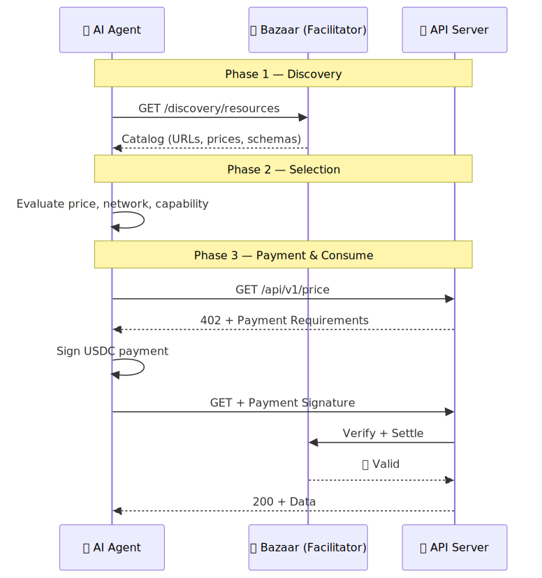

# AI Agents Now Shop for APIs Themselves

> How x402 Bazaar turns the internet into a machine-readable marketplace — and how you can build on it today with our open-source x402-kit on Base.

---

## 1. What Is x402 Bazaar?

Imagine you're an AI agent. Your user asks you to plan a weekend trip — check the weather, find events, buy tickets, update a calendar. Today, you'd need pre-configured API keys for each service, manual integration, and a developer to wire it all together.

**x402 Bazaar changes everything.**

It's the **discovery layer** for the [x402 payment protocol](https://docs.cdp.coinbase.com/x402/welcome) — a machine-readable catalog where AI agents can **find**, **evaluate**, and **pay for** API endpoints autonomously. Think of it as the "Google for agentic endpoints," built by Coinbase.

Here's what makes it powerful:

| For Sellers (API Providers) | For Buyers (AI Agents & Devs) |
|---|---|
| Zero-friction monetization | Discover services at runtime |
| Automatic global visibility | Transparent pricing in USDC |
| No manual listing process | No API keys or subscriptions |
| Pay-per-request revenue | ~200ms per transaction |

The core idea: **services register themselves automatically when they process their first payment.** No approval process. No marketplace listing forms. Just build, get paid, and you're discoverable.

---

## 2. How It Works — The Full Picture

### The Three-Party Architecture

x402 Bazaar operates on three actors integrated into the x402 v2 protocol:



**1. Resource Servers (Sellers)** declare discovery metadata — input/output schemas, examples, pricing — using the `@x402/extensions/bazaar` package.

**2. Facilitators (Payment Processors)** extract this metadata during payment verification and automatically catalog services. The facilitator exposes a `/discovery/resources` endpoint.

**3. Clients (Buyers/Agents)** query the facilitator's discovery endpoint to browse available services, then use `@x402/fetch` to auto-handle the payment cycle.

### The Discovery → Pay → Consume Flow

Here's the complete sequence when an AI agent discovers and uses a paid API:



The entire cycle — discovery, payment signing, on-chain verification, data delivery — completes in **~200 milliseconds**.

---

### Building It: The x402-kit on Base

We built an open-source starter kit that implements all four Bazaar use cases. Let's walk through each one with real code.

#### Project Structure

```
x402-kit/
├── server/
│   ├── index.ts              # Express server with colored banner
│   ├── facilitator.ts        # Testnet/mainnet toggle
│   └── routes/
│       ├── exact.ts          # Fixed-price endpoints + Bazaar metadata
│       └── upto.ts           # Usage-based endpoint + Bazaar metadata
├── client/
│   ├── bazaar-discover.ts    # Browse Bazaar & call discovered APIs
│   ├── bazaar-agent.ts       # Autonomous agent with budget control
│   └── mcp-server.ts         # Claude Desktop integration
└── lib/
    └── terminal.ts           # ANSI color utilities
```

---

### Use Case 1: Publishing Your API to Bazaar (Seller)

Making your endpoint discoverable takes **3 lines of code** on top of a standard x402 server:

```typescript
import { bazaarResourceServerExtension, declareDiscoveryExtension } from "@x402/extensions/bazaar";

// 1. Register the Bazaar extension
const server = new x402ResourceServer(facilitatorClient)
  .register(network, new ExactEvmScheme())
  .registerExtension(bazaarResourceServerExtension);  // ← This line

// 2. Add discovery metadata to your route
"GET /price": {
  accepts: [{ scheme: "exact", price: "$0.001", network, payTo }],
  extensions: {
    ...declareDiscoveryExtension({                    // ← And this block
      output: {
        example: { btc: 95000, usdc: 1.0, timestamp: 1713168000000 },
        schema: {
          properties: {
            btc: { type: "number", description: "BTC price in USD" },
            usdc: { type: "number", description: "USDC price" },
            timestamp: { type: "number", description: "Unix timestamp ms" },
          },
          required: ["btc", "usdc", "timestamp"],
        },
      },
    }),
  },
}
```

For POST endpoints, you also declare the input schema:

```typescript
...declareDiscoveryExtension({
  bodyType: "json",
  input: { prompt: "Summarize the BTCFi ecosystem" },
  inputSchema: {
    properties: {
      prompt: { type: "string", description: "Text prompt for generation" },
    },
    required: ["prompt"],
  },
  output: { example: { result: "Response...", tokensUsed: 13 } },
})
```

**That's it.** After the first buyer pays, the facilitator automatically indexes your service. No registration forms.


---

### Use Case 2: Discovering & Calling APIs (Buyer)

The buyer client uses `withBazaar()` to extend the facilitator client with discovery capabilities:

```typescript
import { withBazaar } from "@x402/extensions/bazaar";
import { wrapFetchWithPayment } from "@x402/fetch";

// 1. Create Bazaar-enabled facilitator client
const bazaar = withBazaar(
  new HTTPFacilitatorClient({ url: "https://x402.org/facilitator" })
);

// 2. Query the catalog
const discovery = await bazaar.extensions.discovery.listResources({
  type: "http",
  limit: 50,
});

// 3. Pay & call a discovered service
const payFetch = wrapFetchWithPayment(fetch, client);
const res = await payFetch(discovery.items[0].resource);
const data = await res.json();
```

The `wrapFetchWithPayment` wrapper automatically:
- Detects 402 responses
- Extracts payment requirements
- Signs USDC authorization with your wallet
- Retries with the payment signature
- Returns the data

---

### Use Case 3: Autonomous Agent with Budget Control

This is where it gets exciting. The Bazaar agent **discovers services dynamically**, ranks them by price, and applies budget gates before paying:



```typescript
// Agent discovers, ranks, and budget-gates automatically
const catalog = await bazaar.extensions.discovery.listResources({ type: "http", limit: 100 });

// Find cheapest service matching "price"
const matches = catalog.items
  .filter(s => s.resource.includes("price"))
  .sort((a, b) => Number(a.accepts[0].amount) - Number(b.accepts[0].amount));

// Budget gate: reject if too expensive
const priceCents = Number(matches[0].accepts[0].amount) / 10_000;
if (priceCents > TASK_BUDGET_CENTS) {
  console.log("REJECTED — exceeds budget");
  return;
}

// Approved — pay and consume
const res = await payFetch(matches[0].resource);
```


---

### Use Case 4: MCP Integration (Claude Desktop)

The MCP server exposes Bazaar as tools that Claude can use directly:

```typescript
// Tool: discover-services
mcp.tool("discover-services", "Search the x402 Bazaar", { query: z.string().optional() },
  async ({ query }) => {
    const discovery = await bazaar.extensions.discovery.listResources({ type: "http", limit: 50 });
    // Filter and return results...
  }
);

// Tool: call-paid-service
mcp.tool("call-paid-service", "Call an API with USDC payment",
  { url: z.string(), method: z.enum(["GET", "POST"]) },
  async ({ url, method }) => {
    const res = await payFetch(url);
    return { content: [{ type: "text", text: JSON.stringify(await res.json()) }] };
  }
);
```

Configure in Claude Desktop (`claude_desktop_config.json`):

```json
{
  "mcpServers": {
    "x402-bazaar": {
      "command": "npx",
      "args": ["tsx", "/path/to/x402-kit/client/mcp-server.ts"],
      "env": { "PRIVATE_KEY": "0xYourKey" }
    }
  }
}
```

Then just ask Claude: *"Search the Bazaar for price services and call the cheapest one."*

---

### Try It Yourself — 5 Minutes Setup

```bash
git clone https://github.com/phamdat/x402-kit.git
cd x402-kit
pnpm install
cp .env.example .env
# Edit .env with your wallet address + private key

# Terminal 1: Start Bazaar-enabled server
pnpm dev

# Terminal 2: Make first payment (populates Bazaar)
pnpm client

# Terminal 3: Browse the Bazaar catalog
pnpm bazaar:discover

# Terminal 4: Run the autonomous agent
pnpm bazaar:agent
```

---

## 3. The Future Is Agents Paying Agents

x402 Bazaar isn't just a developer tool — it's infrastructure for the **AI agent economy**. When agents can discover, evaluate, and pay for services autonomously:

- **API providers** get instant global distribution with zero friction
- **AI agents** compose complex workflows without hardcoded integrations
- **Developers** build pay-per-request services that monetize from day one
- **Users** get agents that can do more, faster, cheaper

The x402 Foundation (Coinbase + Cloudflare) is pushing this toward a decentralized, federated model. Today's Bazaar is "Yahoo search" — the "Google for agentic endpoints" is coming.

**The question isn't whether AI agents will have wallets. It's whether your API will be in their catalog.**

---

### 🔗 Get Started

- **🐦 Follow us for more:** [https://x.com/overguildOG](https://x.com/overguildOG)
- **🛠️ Try the tools:** [https://leo-book.xyz/](https://leo-book.xyz/)
- **📦 x402-kit source:** [GitHub](https://github.com/phamdat/x402-kit)
- **📖 x402 Docs:** [docs.cdp.coinbase.com/x402](https://docs.cdp.coinbase.com/x402/welcome)
- **🏪 Bazaar Docs:** [docs.cdp.coinbase.com/x402/bazaar](https://docs.cdp.coinbase.com/x402/bazaar)

---

*Built with 💙 on Base by [OverGuild](https://x.com/overguildOG)*
