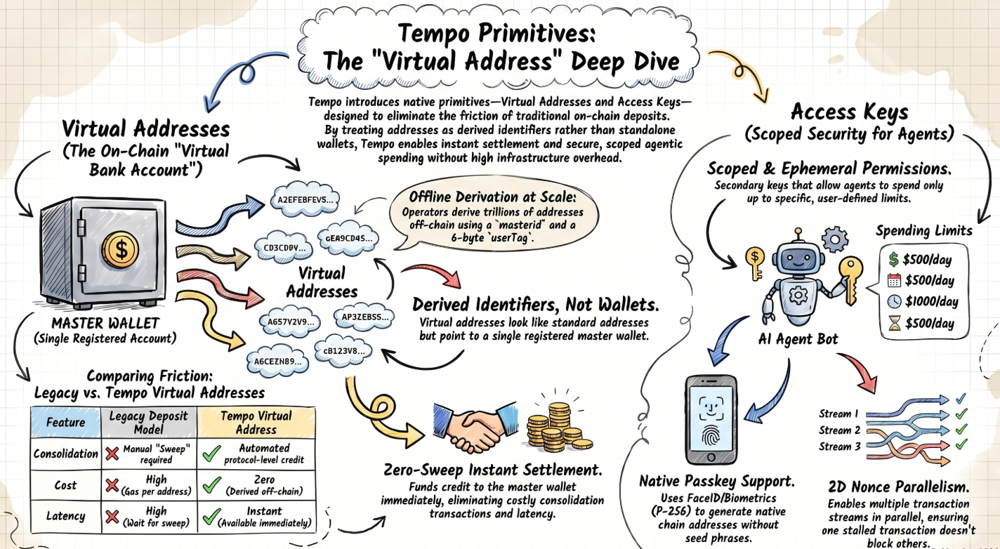

# Virtual Wallets Kill Sweep Transactions Forever

> How Tempo's Virtual Addresses eliminate sweep operations, enable native onchain subscriptions via Access Keys, and unlock frictionless Machine Payments Protocol (MPP) adoption for AI agents and enterprises.

---

> **Tags:** `#Tempo` `#TIP-20` `#TIP-1022` `#TIP-1011` `#MPP` `#Stripe` `#VirtualAddresses` `#AccessKeys` `#Subscriptions` `#Stablecoins`
>
> **Sources:** [Tempo Blog: Virtual Addresses](https://tempo.xyz/blog/virtual-addresses) · [Tempo Blog: Subscriptions](https://tempo.xyz/blog/subscriptions-on-tempo) · [Docs: Virtual Addresses](https://docs.tempo.xyz/guide/payments/virtual-addresses) · [TIP-1022 Spec](https://docs.tempo.xyz/protocol/tips/tip-1022) · [TIP-1011 Spec](https://docs.tempo.xyz/protocol/tips/tip-1011)

---

## 🌐 What Are Virtual Addresses?

Every exchange, neobank, and marketplace that accepts crypto deposits hits the same wall: **unique deposit addresses per customer means thousands of real onchain accounts**, each requiring state rent, sweep transactions to consolidate funds, and constant monitoring infrastructure.

This is the sweep problem — and it's been the silent tax on every stablecoin business at scale.

**Tempo's Virtual Addresses eliminate it entirely.**

> 💡 A **virtual address** looks exactly like a normal blockchain address to the sender — but it is **not** a standalone wallet. It's a **derived identifier** that points to a registered master wallet. When a TIP-20 stablecoin is sent to a virtual address, the Tempo protocol resolves and credits the funds **directly to the master wallet** — no sweep transaction required.

Think of it as the **onchain equivalent of virtual bank accounts** — a fintech can issue thousands of unique IBANs to customers, but all funds settle into one real account behind the scenes.

### 🚧 The Problem Before Virtual Addresses

| Problem | Impact |
|---|---|
| Each deposit address = a real onchain account | Requires state rent / account initialization cost |
| Funds land in individual addresses | Needs **sweep transactions** to consolidate to treasury |
| Thousands of active endpoints | Higher infra overhead, monitoring, compliance complexity |
| Sweep adds latency | Funds stuck between "received" and "available" |

---

## ⚙️ How Virtual Addresses Work



Here's the complete flow, step by step:

```
1. A business registers ONE master wallet on Tempo
2. It derives trillions of customer-specific virtual addresses OFFLINE
   (no on-chain transaction needed per address)
3. Customer sends TIP-20 stablecoin → virtual address
4. Tempo detects the virtual address format
5. Protocol resolves → master wallet
6. Master wallet balance is credited directly
7. Two Transfer events are emitted for full attribution:
   - Transfer(sender → virtualAddress, amount)
   - Transfer(virtualAddress → master, amount)
```

### Sequence Diagram

```
Sender ──── transfer(virtualAddress, amount) ────▶ TIP-20 Contract
                                                       │
                                                       ▼
                                              resolve(masterId)
                                                       │
                                              Virtual Registry
                                                       │
                                              returns master wallet
                                                       │
                                                       ▼
                                              Registered Wallet
                                              credit balance ✅
```

### 🛠️ Deriving Virtual Addresses (Dev View)

Once a master is registered, operators derive virtual addresses **fully offchain** — zero gas, zero network calls:

```ts
import { VirtualAddress } from 'ox/tempo'

const virtualAddress = VirtualAddress.from({
  masterId,
  userTag: '0x000000000001', // your internal customer/invoice ID
})
```

- `masterId` = the registered master wallet identifier
- `userTag` = any 6-byte hex value (customer ID, invoice ref, corridor tag)
- **No gas cost, no network call** needed to derive addresses

### ✅ Key Properties

| Property | Behavior |
|---|---|
| `balanceOf(virtualAddress)` | Always returns `0` |
| Funds landing | Go directly to master wallet |
| Attribution | Via Transfer events + your `userTag` mapping |
| Policy checks (compliance, KYC) | Applied to the **resolved master**, not virtual address |
| Reward protocols (DEX, lending) | ⚠️ Avoid — virtual addresses can't hold/track funds |

### 🏢 Who Benefits Most?

- 🏦 **Exchanges & brokers** — dedicated deposit address per user, zero sweep overhead
- 🔄 **Onramps / offramps** — attribute inbound customer funds cleanly
- 🛒 **Marketplaces** — one address per merchant or invoice
- 🏛️ **Treasury platforms** — segmented inbound payment routing

---

## 🔑 Access Keys — Scoped Wallet Delegation

The second primitive that makes this system complete is the **Access Key**.

> 💡 An Access Key lets a user **delegate signing authority** to a service — with strict, user-defined constraints. Think of it as a **scoped API key for your wallet** — a service gets permission to charge you, but only up to a defined amount, on specific tokens, for a limited time.

### How Access Keys Work

```
1. User authorizes an Access Key, defining:
   - Maximum spend amount
   - Allowed token(s)
   - Expiry date
   - (Optional) Specific contract addresses & function selectors
   - (Optional) Periodic spending cap (e.g., $50/week)

2. User hands the Access Key to the service

3. Service uses the key to "pull" funds from the user's account
   → within the spending limits
   → until expiry
   → scoped to defined contracts only

4. Protocol validates each charge against remaining allowance
   → If it fits → ✅ approved
   → If it exceeds → ❌ rejected

5. For periodic limits: window resets automatically each period
   → No re-approval needed from user
```

### 🔐 Access Key Parameters

| Parameter | Description |
|---|---|
| `maxAmount` | Total cap the service can spend |
| `token` | Which TIP-20 stablecoins are allowed |
| `expiry` | When the key stops being valid |
| `contract scope` | Which smart contracts can be called |
| `function selector` | Which specific functions can be called |
| `periodicLimit` | Amount allowed per time period (e.g., $50/week) |

### 🔁 Periodic Spending Limits = Native Onchain Subscriptions

This is the biggest unlock. Access Keys with **periodic spending limits** enable **native onchain subscriptions** — no more re-approval every billing cycle:

```
Old way:
  → Require fresh user signature every billing cycle   😫
  → OR: get approval for a whole year upfront          😰

New way with Access Keys:
  → User sets "$50/week for the next 50 weeks" once    ✅
  → Service charges weekly, auto-validated by protocol  ✅
  → Week resets → allowance refreshes automatically     ✅
  → User can revoke anytime                             ✅
```

**Use cases enabled:**

- 📰 Newsletter or streaming service subscription
- 🤖 AI agent with a monthly API budget (e.g., `$100/month` scoped to a specific inference contract)
- 🌍 SaaS billing across 30+ countries — one access key, one stablecoin, instant settlement

---

## 🤝 Combined: The Full MPP Payment Stack

Virtual Addresses + Access Keys together give [Machine Payments Protocol (MPP)](https://docs.tempo.xyz/learn/tempo/machine-payments) services a **complete, enterprise-grade payment stack**.

### 🚧 MPP Adoption Challenges (Before)

| Challenge | Why It Hurt |
|---|---|
| Per-request payment approval | Too much friction, breaks automation |
| No recurring billing primitive | Agents can't subscribe to services |
| Wallet exposure risk | Giving a service full wallet access = security risk |
| Infrastructure complexity for API providers | Hard to issue unique deposit endpoints at scale |

### ✅ How Virtual Addresses + Access Keys Solve It

**1️⃣ Access Keys → Frictionless Agentic Payments**

An AI agent gets an Access Key **scoped to a specific MPP service contract**, with a defined monthly budget:

```
Agent has Access Key:
  → contract: inference_api.tempo
  → limit: $100/month
  → expiry: 6 months

Agent calls the service throughout the month
  → Each charge validated against remaining allowance
  → No re-approval, no re-prompting
  → Limit resets monthly automatically
  → Key CANNOT be used elsewhere ✅
```

**2️⃣ Virtual Addresses → Scalable MPP Service Infrastructure**

For API providers monetizing via MPP:

```
Before virtual addresses:
  Each API client needs a unique deposit address
  → Sweep transactions for every deposit
  → Monitoring thousands of balance endpoints
  → Latency, gas cost, operational failure risk

After virtual addresses:
  Register ONE master wallet
  Derive unique address per client/invoice OFFCHAIN
  → All deposits → master wallet directly
  → Events still carry full attribution
  → Zero sweep operations ✅
```

**3️⃣ Combined: Full Stack**

```
┌─────────────────────────────────────────────────────┐
│                  MPP Service Provider                │
│  ┌──────────────────┐    ┌────────────────────────┐ │
│  │  Virtual Address  │    │      Access Key         │ │
│  │  per client/      │    │  Periodic limit:        │ │
│  │  invoice/corridor │    │  "$50/month"            │ │
│  │                   │    │  Scoped to this API     │ │
│  │  → All funds      │    │  → Auto-charges client  │ │
│  │    land in        │    │  → No re-approval       │ │
│  │    master wallet  │    │  → Client can revoke    │ │
│  └──────────────────┘    └────────────────────────┘ │
│         ↓                          ↓                 │
│    Clean reconciliation    Reliable recurring revenue │
└─────────────────────────────────────────────────────┘
```

### 🌍 Real-World Scenarios Unlocked

| Scenario | Virtual Address | Access Key |
|---|---|---|
| AI agent pays per inference request | ✅ Provider receives in master wallet | ✅ Agent has scoped monthly budget |
| Developer subscribes to blockchain data API | ✅ Unique deposit address per developer | ✅ Weekly spending limit, auto-renewed |
| Marketplace settles per-merchant payouts | ✅ One address per merchant, one treasury | ✅ Scheduled pull payments |
| SaaS platform with global stablecoin billing | ✅ No sweep overhead for inbound funds | ✅ One-time authorization, recurring charges |

---

## 🧠 Summary

Tempo's **Virtual Addresses** and **Access Keys** are not UX improvements — they are **protocol-native primitives** that make stablecoin payments composable, scalable, and safe enough for both enterprise treasury operations and autonomous AI agents.

Together, they remove the two biggest blockers for MPP adoption:
1. The **operational complexity** of managing deposits at scale
2. The **friction of per-request payment authorization** in automated workflows

### 🔗 Related Protocols & Standards

| Protocol | Role |
|---|---|
| [Tempo](https://tempo.xyz) | Payments-first blockchain |
| [TIP-20](https://docs.tempo.xyz/protocol/tip20/overview) | Native stablecoin token standard |
| [TIP-1022](https://docs.tempo.xyz/protocol/tips/tip-1022) | Virtual address forwarding spec |
| [TIP-1011](https://docs.tempo.xyz/protocol/tips/tip-1011) | Enhanced access key permissions |
| [MPP](https://docs.tempo.xyz/learn/tempo/machine-payments) | Open standard for agentic payments (Stripe × Tempo) |
| [pathUSD](https://docs.tempo.xyz/quickstart/faucet) | Primary TIP-20 stablecoin on Tempo |

---

## 🚀 What's Next?

> **Follow us** for more deep dives into the protocols powering the machine economy:
>
> 🐦 [**Subscribe on X →**](https://x.com/overguildOG)
>
> 🛠️ [**Try our new tools at Leo Book →**](https://leo-book.xyz/)

---

*📬 For enterprise inquiries: [partners@tempo.xyz](mailto:partners@tempo.xyz) · [tempo.xyz/advisory](https://tempo.xyz/advisory)*
