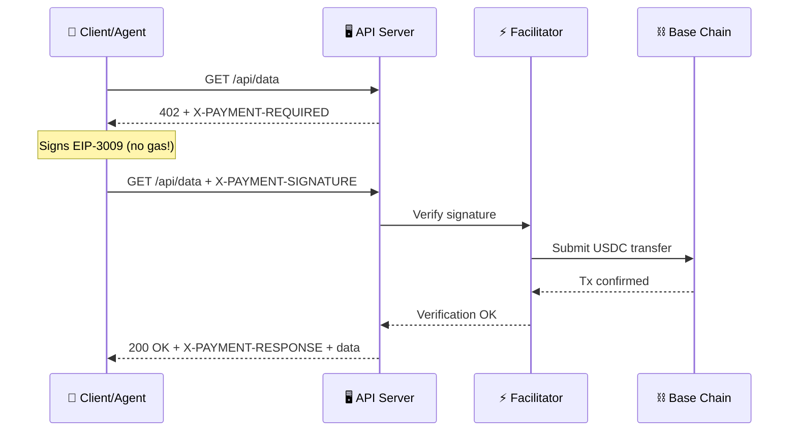
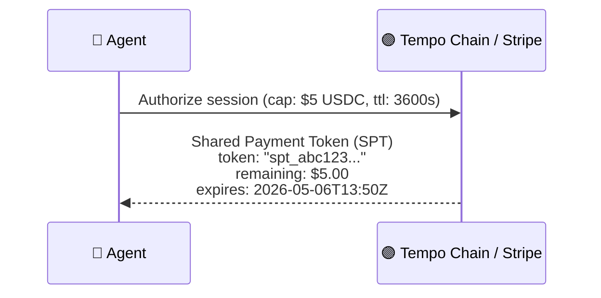
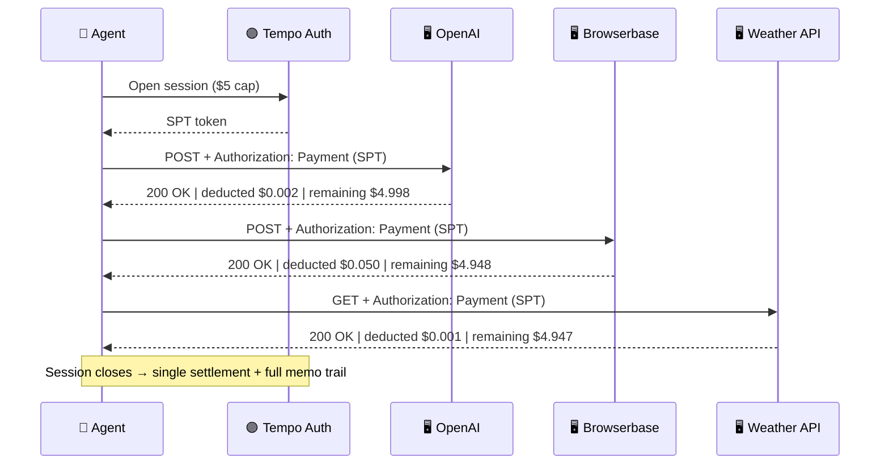

> 💡 **TL;DR** — Both x402 and MPP hijack a single HTTP status code (`402 Payment Required`) and embed all payment instructions inside response **headers** — not the body. The header *name* tells the client which protocol to use. The header *value* tells it exactly what to pay, to whom, and how.

> **Tags:** `#x402` `#MPP` `#Tempo` `#Stripe` `#Coinbase` `#HTTP402` `#AIAgentPayments` `#Web3Payments` `#USDC` `#EIP3009` `#TIP20` `#MachinePayments`
>
> **Sources:** [x402.org](https://www.x402.org) · [MPP Docs](https://mpp.dev/overview) · [Stripe Blog](https://stripe.com/blog/machine-payments-protocol) · [Alchemy](https://www.alchemy.com/blog/how-x402-brings-real-time-crypto-payments-to-the-web)

---

## 📡 What Are Payment Headers?

HTTP has a built-in separation of concerns — **headers carry metadata**, **body carries content**. Payment is infrastructure metadata, not content.

Both x402 (by Coinbase) and MPP (by Stripe/Tempo) chose to embed payment instructions entirely in HTTP headers. Here's why:

| Reason | Explanation |
|---|---|
| **402 has no body by convention** | Like `401` and `403`, a refusal response signals via headers — the body is empty or irrelevant |
| **Works across all HTTP methods** | `GET` requests have no body; headers work for GET, POST, PUT, DELETE equally |
| **Middleware-transparent** | Proxies, CDNs, and API gateways can read headers without touching the body |
| **Enables the retry pattern** | Client reads payment header, pays, retries the *same* request — body is re-sent as-is |
| **Faster** | Headers are read before the body is streamed — no buffering needed for payment decisions |

### 🏛️ The Shared Foundation — HTTP 402

Both protocols start from the exact same status code, dead since 1991 and now revived for the agentic economy:

```http
HTTP/1.1 402 Payment Required
```

`402` was reserved in the original HTTP/1.0 spec (RFC 1945, 1996) as "reserved for future use." It was never officially used — until now. Both Coinbase (x402) and Stripe (MPP) independently chose it as the natural home for machine-native payment challenges.

After this status line, the server adds **one of two completely different headers** — that difference is everything.


---

## 🔵 How x402 Works — Header by Header

x402 is a **stateless, per-request, on-chain payment protocol**. Think of it as a **vending machine**: insert exact change, receive product, transaction complete. No memory, no session, no subscription.

### Step 1 — Server Sends `X-PAYMENT-REQUIRED`

When a client hits a paid endpoint without payment, the server responds:

```http
HTTP/1.1 402 Payment Required
X-PAYMENT-REQUIRED: {
  "scheme":               "exact",
  "network":              "base",
  "maxAmountRequired":    "1000",
  "asset":                "0x833589fCD6eDb6E08f4c7C32D4f71b54bdA02913",
  "payTo":                "0xMerchantWalletAddress",
  "resource":             "/api/v1/data",
  "description":          "1 API query — weather data",
  "mimeType":             "application/json",
  "estimatedProcessingTime": 200,
  "expires":              "2026-05-06T12:30:00Z"
}
```

#### 🔑 Field Breakdown

| Field | Type | What It Means |
|---|---|---|
| `scheme` | string | Sub-protocol — `"exact"` means pay-exactly-this-amount on-chain |
| `network` | string | Blockchain to settle on — `"base"`, `"ethereum"`, `"polygon"` |
| `maxAmountRequired` | string (wei) | Amount in smallest unit — `"1000"` = $0.001 USDC (6 decimals) |
| `asset` | address | ERC-20 token contract — USDC on Base |
| `payTo` | address | Merchant's receiving wallet |
| `resource` | string | URL path being monetized |
| `description` | string | Human/agent-readable description |
| `mimeType` | string | Content type of the paid response |
| `estimatedProcessingTime` | ms | Server wait time for payment verification |
| `expires` | ISO 8601 | Payment instruction expiry |

---

### Step 2 — Client Sends `X-PAYMENT-SIGNATURE` (Retry)

The client signs an **EIP-3009 `transferWithAuthorization`** — a gasless, off-chain cryptographic authorization — and retries:

```http
GET /api/v1/data HTTP/1.1
X-PAYMENT-SIGNATURE: {
  "scheme":    "exact",
  "network":   "base",
  "payload": {
    "from":          "0xAgentWalletAddress",
    "to":            "0xMerchantWalletAddress",
    "value":         "1000",
    "validAfter":    "0",
    "validBefore":   "1746527400",
    "nonce":         "0xRandomNonce32Bytes",
    "v": 27, "r": "0x...", "s": "0x..."
  }
}
```

> 🔐 This signature is **cryptographically bound** to the exact recipient, amount, and time window. Even if intercepted, it cannot be redirected, reused for a different amount, or replayed after expiry.

---

### Step 3 — Server Returns `X-PAYMENT-RESPONSE`

After the facilitator verifies the signature on-chain:

```http
HTTP/1.1 200 OK
X-PAYMENT-RESPONSE: {
  "success":    true,
  "txHash":     "0xOnChainTransactionHash",
  "network":    "base",
  "payer":      "0xAgentWalletAddress",
  "amount":     "1000",
  "asset":      "USDC"
}
Content-Type: application/json

{ "temperature": 32, "city": "Ho Chi Minh City" }
```

---

### 🏗️ The Facilitator — The Hidden Component

The **facilitator** sits between server and blockchain. It makes x402 work without requiring every API server to run a full Ethereum node.



**Key properties:**
- 🔒 Cannot move funds beyond what client authorized
- ⚡ Abstracts all blockchain complexity from the API server
- 🌐 Coinbase hosts a free reference facilitator
- 🛠️ Anyone can self-host for full decentralization

**x402 Summary:**
- ⏱️ Total round-trip: ~200–500ms
- 💰 Cost per request: ~$0.001 USDC
- ⛽ Gas paid by: Facilitator (client never pays gas directly)

---

## 🟣 How MPP Works — Header by Header

MPP is a **stateful, session-based, multi-rail payment protocol** by Stripe + Tempo. Think of it as a **hotel minibar tab**: authorize a spending cap once, consume services freely, settle at the end.

### Step 1 — Server Sends `WWW-Authenticate: Payment`

MPP reuses the **official IANA-registered** `WWW-Authenticate` header — the same header used by `Bearer` tokens and `Basic` auth. Existing HTTP middleware already understands it.

```http
HTTP/1.1 402 Payment Required
WWW-Authenticate: Payment
  challenge="a1b2c3d4e5f6",
  price="0.001",
  currency="USDC",
  recipient="0xServiceWalletAddress",
  network="tempo",
  session_ttl="3600",
  pricing_model="per_request",
  realm="api.openai.com"
```

#### 🔑 Field Breakdown

| Field | Type | What It Means |
|---|---|---|
| `challenge` | string | Server-generated nonce — prevents replay attacks |
| `price` | decimal | Cost per unit — `"0.001"` USDC per API call |
| `currency` | string | Accepted currency — `"USDC"`, `"USDT"`, `"EURC"` |
| `recipient` | address | Service provider's address on Tempo |
| `network` | string | Settlement rail — `"tempo"`, `"stripe"`, `"lightning"` |
| `session_ttl` | seconds | Session duration — `3600` = 1 hour |
| `pricing_model` | string | `"per_request"`, `"per_token"`, `"per_second"`, `"per_byte"` |
| `realm` | string | Service/domain requesting payment |

---

### Step 2 — Client Opens Session & Gets SPT

Before retrying, the client calls the Tempo/Stripe authorization endpoint to open a session with a spending cap:



> 💡 **The Shared Payment Token (SPT)** is what makes MPP multi-rail. The same SPT can be backed by:
> - USDC on Tempo chain (crypto-native)
> - A Stripe credit card (fiat)
> - Lightning Network (Bitcoin via Lightspark)
> - Corporate buy-now-pay-later (enterprise)
>
> The API server never needs to know which rail is underneath.

---

### Step 3 — Client Sends `Authorization: Payment` (Retry)

```http
POST /v1/chat/completions HTTP/1.1
Authorization: Payment
  token="spt_abc123xyz",
  challenge="a1b2c3d4e5f6",
  amount="0.001",
  currency="USDC"
Content-Type: application/json

{ "model": "gpt-5", "messages": [...] }
```

> 🧩 The body is untouched. Payment lives entirely in the `Authorization` header — the server processes it like any other auth type.

---

### Step 4 — Server Returns `Payment-Response`

```http
HTTP/1.1 200 OK
Payment-Response: {
  "status":       "settled",
  "deducted":     "0.001",
  "currency":     "USDC",
  "remaining":    "4.999",
  "session":      "spt_abc123xyz",
  "tx_ref":       "tempo_tx_0xabc...",
  "memo":         "ChatGPT /completions call #1"
}
Content-Type: application/json

{ "choices": [...] }
```

> 📋 The `memo` field maps to Tempo's **TIP-20 on-transfer memo** — every micro-deduction is recorded on-chain with a human-readable memo for automatic invoice reconciliation.

---

### 🔄 MPP Session Flow — Multi-Service



**MPP Summary:**
- ⏱️ Session auth: ~1 round-trip (one-time)
- ⏱️ Per-call overhead after that: ~0ms (SPT validated in-memory)
- ⚡ On-chain settlement: ~0.5s on Tempo
- 💰 Cost per request: sub-$0.001

---

## ⚡ Side-by-Side Comparison

| Dimension | 🔵 x402 | 🟣 MPP |
|---|---|---|
| **Challenge header** | `X-PAYMENT-REQUIRED` (custom) | `WWW-Authenticate: Payment` (IANA standard) |
| **Payment header** | `X-PAYMENT-SIGNATURE` | `Authorization: Payment` |
| **Confirmation header** | `X-PAYMENT-RESPONSE` | `Payment-Response` |
| **Payment model** | Stateless per-request | Stateful session with spending cap |
| **Auth object** | EIP-3009 signed message | Shared Payment Token (SPT) |
| **Settlement rails** | On-chain only (USDC, EVM) | Multi-rail: USDC + Stripe fiat + Lightning |
| **Session memory** | ❌ None — every request is fresh | ✅ SPT tracks balance across requests |
| **Gas handling** | Facilitator pays | No gas token — fees in USDC natively |
| **Pricing flexibility** | Per-request fixed price | Per-request, per-token, per-second, per-byte |
| **Best for** | Single API calls, data feeds | Multi-service workflows, streaming, enterprise |
| **Standard compliance** | Non-standard `X-` header | Extends RFC 7235 `WWW-Authenticate` |
| **Backed by** | Coinbase, Cloudflare, Circle | Stripe, Paradigm, Visa, Lightspark |

---

## 🔍 How to Detect Which Protocol

The detection is deterministic — check which header is present:

```typescript
function detectPaymentProtocol(
  response: Response
): "x402" | "mpp" | "both" | "unknown" {

  if (response.status !== 402) return "unknown";

  const wwwAuth  = response.headers.get("WWW-Authenticate") ?? "";
  const xPayment = response.headers.get("X-PAYMENT-REQUIRED") ?? "";

  const hasMPP  = wwwAuth.trimStart().startsWith("Payment");
  const hasX402 = xPayment.length > 0;

  if (hasMPP && hasX402) return "both";
  if (hasMPP)            return "mpp";
  if (hasX402)           return "x402";

  return "unknown";
}
```

### 🌐 When a Server Supports Both

Cloudflare and other infrastructure providers can serve **both headers simultaneously**:

```http
HTTP/1.1 402 Payment Required
X-PAYMENT-REQUIRED: {"scheme":"exact","network":"base","maxAmountRequired":"1000",...}
WWW-Authenticate: Payment challenge="abc123",price="0.001",network="tempo",...
```

| Client Type | Chooses | Why |
|---|---|---|
| Crypto-native agent on Base | 🔵 x402 | Already has USDC on Base, simple EIP-3009 |
| Enterprise agent with Stripe | 🟣 MPP | Corporate card backing, invoice reconciliation |
| Agent on Tempo chain | 🟣 MPP | Sub-0.5s finality, TIP-20 memos |
| Simple one-off script | 🔵 x402 | No session overhead |
| Long-running multi-service workflow | 🟣 MPP | One auth, auto-deduct, single reconciliation |

> 🎯 **Key insight**: x402 and MPP are **not competitors**. An MPP session can use x402 as its underlying per-payment mechanism. They compose — MPP handles the session layer, x402 handles individual atomic payments within it.

---

## 🎯 Conclusion — The Header Is the New Payment Rail

HTTP headers have quietly become the most important payment infrastructure of the agentic era:

- **x402** turns any HTTP endpoint into a pay-per-use vending machine with 3 custom headers
- **MPP** turns any HTTP endpoint into a session-based billing system using standard auth headers
- **Together** they cover every use case from one-off API calls to enterprise streaming workflows

The internet already speaks HTTP. Now it speaks money too — one header at a time.

---

### 🚀 Stay Connected

📢 **Subscribe for more Web3 builder content:**
👉 [Follow @overguildOG on X](https://x.com/overguildOG)

🛠️ **Try our new AI-powered tools:**
👉 [leo-book.xyz](https://leo-book.xyz/)

---

### 🔗 Resources

- [x402.org — Official Protocol](https://www.x402.org)
- [MPP Docs — Overview](https://mpp.dev/overview)
- [Stripe — Introducing MPP](https://stripe.com/blog/machine-payments-protocol)
- [Alchemy — x402 Explained](https://www.alchemy.com/blog/how-x402-brings-real-time-crypto-payments-to-the-web)
- [EIP-3009 — Transfer With Authorization](https://eips.ethereum.org/EIPS/eip-3009)
- [Tempo Chain](https://tempo.xyz)
- [Crossmint — Protocol Comparison](https://www.crossmint.com/learn/agentic-payments-protocols-compared)
